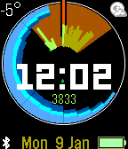

a "circadian" Pebble watch face with weather from yr.no and darksky.net

   

Intended for use with [GadgetBridge](https://github.com/Freeyourgadget/Gadgetbridge),
thus it has its own Android companion app rather than relying on Javascript.

yr.no provides nice forecasts, but not real-time sensor readings AFAICT.
So, using darksky.net for now, but perhaps not for the long term
(using it too much will cost money).

What's working:
- [x] real-time temperature and cloudy/sunny icons from darksky.net
- [x] time, date, battery and bluetooth status
- [x] name (locality) of current location
- [x] sunrise/sunset times calculated in the Android app
- [x] 24-hour dial with highlighted region for daylight hours
- [x] today's step counts as a radial bar graph, in green
- [x] today's total step count
- [x] yesterday's step counts in dimmer green
- [x] NowCast, the yr.no highly-localized prediction of upcoming precipitation for the next 2 hours.
- [x] precipitation forecast beyond the next 2 hours
- [x] temperature forecast
- [x] second screen (accessed via wrist flick/tap) showing longer forecast (full-width horizontal chart), and the time
- [x] Android app includes and installs the Pebble watch face

In progress:
- [ ] learning the user's active periods of day, so as to ask the phone to fetch weather updates during that time only.  That plus a frequency limit should keep API calls to a minimum.
- [ ] Android widget for yr.no "meteogram" - currently has hard-coded location, need to figure out how to get suitable location by reverse-geocoding

Not started yet:
- [ ] reverse geocoding to get the name of the current location (at least the city), and/or nearest weather station
- [ ] calculate sunrise/sunset in the Pebble app, based on current location; persist current location on Pebble.  (The problem now is that every time you leave the watch screen, it loses those times.)
- [ ] label the temperature range on the forecast chart
- [ ] send the rest of the forecast across to the Pebble (wind? cloud level?)
- [ ] show moonrise/set - second screen
- [ ] preferences on Android
  - [ ] colors? maybe use https://github.com/gabrielemariotti/colorpickercollection
  - [ ] what to show and where?
- [ ] Android: show time since weather update, expected active periods today (or even all week)
- [ ] get real-time weather from some other source, preferably an open source where users' weather station data is contributed
- [ ] Android widget for weather radar?
- [ ] weather radar in the Android app (main activity)
- [ ] yr.no forecast chart / meteogram: zoomed view, accessed from main activity or by clicking the home screen widget

